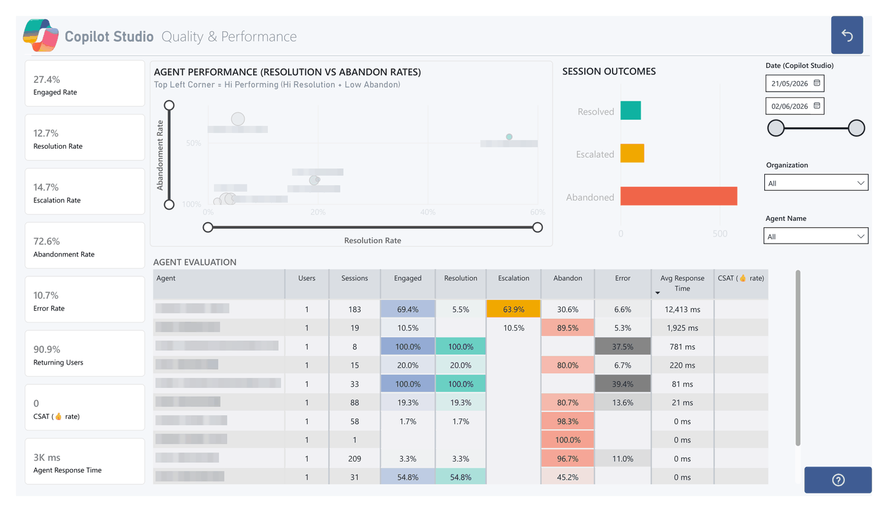

<div align="center">

# 🔎 AgentLens

### **for Copilot Studio** — a Power BI template for **deep agent performance & evaluation**: quality, containment, topics, transcripts, errors, feedback, and message-credit consumption.

[](https://github.com/Keithland89/AgentLens-for-Copilot-Studio)
[](#connect-the-template)
[](#deployment-options)
[](https://github.com/Keithland89/AgentLens-for-Copilot-Studio/stargazers)

**Agent sessions · turns · errors · sub-agent calls · quality & performance · topics · knowledge files ·
user feedback · Copilot Studio message-credit consumption** — purpose-built to analyse how your
**Copilot Studio agents** actually perform, resolve, contain, and cost.



> *Demo shown with anonymised sample data.*

Found this useful? ⭐ **Star this repo to help others discover it!**

**[Deployment options ↓](#deployment-options)** · **[Connect the template ↓](#connect-the-template)**

</div>

<details>
<summary>⚠️ <strong>Usage & compliance disclaimer</strong></summary>

While this tool helps customers understand the business value of their AI usage data, Microsoft has
**no visibility** into the data customers input, nor control over how the template is used. Customers
are solely responsible for ensuring their use complies with all applicable laws and regulations
(including data privacy and security). **Microsoft disclaims all liability** arising from use of this
template.

This is an **experimental** template that reads Copilot Studio conversation transcripts from
Dataverse. Transcripts are intended to give visibility into agent interactions, not to serve as the
sole source of truth for licensing or full-fidelity reporting. Not supported through Microsoft
support channels — please open an issue in this repo.
</details>

---

## Deployment options

Two builds of the **same AgentLens** template — pick the one that fits your platform:

| Build | Best for | Needs | Where |
|---|---|---|---|
| **Dataverse-native** ⭐ | simplest footprint — transcripts parsed **in the Power BI model** (Power Query M), nothing else to stand up | a Dataverse env + a CSV folder | this folder (repo root) |
| **Fabric / Lakehouse** | scheduled Spark ingestion, larger volumes, and **PPAC message-credit** pages | a Fabric capacity + Lakehouse | [`Fabric/`](./Fabric/) |

Both surface the same AgentLens analytics; the Dataverse build reads live transcripts, the
Fabric build lands them (plus credit consumption) as Delta tables. The rest of this page covers the
**Dataverse-native** build; see [`Fabric/README.md`](./Fabric/README.md) for the Fabric build.

---

```
Dataverse conversationtranscripts ─(native connector)─┐
                                                       ▼
                       Power Query M parser (in the model)
                                                       ▼
   Agent Sessions · Turns · Errors · Sub-Agent Calls · Performance · Catalogue
                                                       ▼
   + org / Agents 365 ─(direct CSV file paths)────────────────► dashboard
```

> **Just want to run it?** Open **[`AgentLens - Dataverse.pbit`](./AgentLens%20-%20Dataverse.pbit)**
> in Power BI Desktop, set the three parameters below, and **Load**.

---

## Connect the template

The `.pbit` is **pre-set to Dataverse** — you only set three parameters:

| Parameter | Required? | Value |
|---|---|---|
| **Dataverse Url** | **Yes** | your environment URL, e.g. `https://yourorg.crm.dynamics.com` — or **several** separated by `;` to combine environments (see below) |
| **Org Data CSV** | **Yes** | full file path (SharePoint URL or local/synced/UNC) to `copilot_org_data.csv` |
| **Agent 365 CSV** | optional | full file path to `agents_365.csv` — **leave blank to skip** |

On first refresh you'll get a one-time **Dataverse** sign-in: choose **Organizational account**, sign
in with an org login that can **read the Conversation Transcript table**, and set the source privacy
level to **Organizational** if prompted. Then enable **Scheduled refresh** in the Service as usual.

> **No app registration / client secret** — the report uses the native Dataverse connector with the
> refresher's own org login.

<details>
<summary><strong>Multiple environments in one report</strong> — combine several Dataverse orgs</summary>

The **Dataverse Url** parameter accepts **more than one environment URL**, separated by a **semicolon**
(or one per line):

```
https://org-a.crm.dynamics.com; https://org-b.crm.dynamics.com; https://org-c.crm.dynamics.com
```

The model pulls `conversationtranscripts` from **every** environment in a single refresh, tags each row
with the source **`environment`**, and unions them — so all agents across all environments appear in
one report. A single URL still works exactly as before.

**Robust by design:** each environment is fetched independently inside a `try…otherwise`, so an
unreachable or empty environment is **skipped**, not fatal — the refresh still completes with the
environments that did respond.

**What you need to do:**

1. **List the environment URLs** in the **Dataverse Url** parameter, semicolon-separated (Power Platform
   Admin Center → Environments → *each env* → **Environment URL**).
2. **Read access in every environment.** The refresher's org login needs **Read** on the **Conversation
   Transcript** table in **each** environment (same role as the single-env case — e.g. System
   Customizer / Environment Maker — granted per environment).
3. **Sign in per environment on first refresh.** Each environment URL is a **separate data source**, so
   Power BI prompts once per environment — choose **Organizational account** and set privacy to
   **Organizational** for each. In the Service, **Scheduled refresh** needs credentials configured for
   **every** environment URL under dataset **Settings → Data source credentials**.
4. **Keep privacy levels consistent** (all **Organizational**) across the environment sources and the
   Org Data CSV, or Power Query's *Formula.Firewall* may block combining them.
5. **Refresh.** All environments load into one model; the `environment` tag is available on the base
   transcript data for filtering.

> **Optional — surface an Environment slicer.** Row-level `environment` is carried on the parsed base
> data. To slice a specific fact table (e.g. *Agent Sessions*) by environment, add `environment` to that
> table's `Table.SelectColumns(...)` output in the parser function, then drop a slicer on the column.

</details>

---

<details>
<summary><strong>What you need</strong> — environment, permissions & CSVs</summary>

**In your tenant**
- The **Dataverse environment URL** holding the Copilot Studio transcripts (Power Platform Admin
  Center → Environments → *your env* → **Environment URL**).
- A refresher sign-in with **Read** on the **Conversation Transcript** table — e.g. *System
  Administrator*, *System Customizer*, *Environment Maker*, or a least-privilege custom role.

**Supporting CSVs** (each pointed to by its own full-path parameter):

| File | Source export | Parameter | Required? |
|---|---|---|---|
| `copilot_org_data.csv` | Entra → Users (manual export) **or** a Graph `/users` → SharePoint landing flow | **Org Data CSV** | **Yes** (org filter on every page) |
| `agents_365.csv` | M365 Admin → Agents → **Export** | **Agent 365 CSV** | optional |

Org data is read from the **raw portal export** — the model normalises headers and US-format dates
for you. Leave the Agents 365 path blank and that table loads empty (visuals degrade gracefully).

> **Org data stays a CSV (not Dataverse)** so you keep both acquisition methods — a manual Entra
> export, or an Entra-Graph → SharePoint landing flow.
</details>

<details>
<summary><strong>How the file paths work</strong> — connectors & gateway</summary>

Each CSV parameter takes a **full file path**, auto-detected:

| You enter | Connector | Refresh in the Service |
|---|---|---|
| A **SharePoint file URL** (`https://contoso.sharepoint.com/.../copilot_org_data.csv`) | `Web.Contents` | ✅ cloud-to-cloud, **no gateway** (source = *Organizational account* / OAuth2) |
| A **local / synced file** (`C:\AIBV\copilot_org_data.csv`) | `File.Contents` | needs an **on-premises data gateway** |
| A **UNC path** (`\\server\share\copilot_org_data.csv`) | `File.Contents` | needs a gateway |

> A **SharePoint file URL is easiest to schedule-refresh** — no gateway. Pointing at the exact file
> (not a folder) means the report won't silently miss a renamed export.
</details>

<details>
<summary><strong>How the transcript parser works</strong></summary>

The model carries Power Query functions (see
[`model_expressions_reference.tmdl`](./model_expressions_reference.tmdl)) that parse the raw
`conversationtranscripts` JSON into fact tables — entirely in the model, no external compute:

| M function | Produces |
|---|---|
| `RawTranscripts()` | one row per transcript (live from Dataverse) |
| `ParsedBase()` | parses each `content` JSON once into an `activities` list |
| `Parse_Sessions()` | `Agent Sessions` (one row per conversation) |
| `Parse_Turns()` | `Agent Turns` (per message, with intent / knowledge / feedback) |
| `Parse_Errors()` | `Agent Errors` |
| `Parse_SubAgents()` | `Agent Sub-Agent Calls` |
| `Parse_Performance()` | `Agent Performance` (per-conversation KPI fact) |

`Agent Catalogue` self-derives from the parsed sessions + sub-agents.

**Notes / limitations**
- **Topics** are classified by generic, customer-agnostic DAX — no extra services or LLM enrichment.
- **Agent name** resolves via the Dataverse bot lookup where exposed, else from transcript content.
- Token / plugin telemetry columns are null in this path (not in the transcript JSON); the value
  model doesn't depend on them.
- Conversation transcripts default to ~30-day retention in Dataverse — the dashboard sees only what
  the environment currently holds.
</details>

<details>
<summary><strong>Verifying the connection</strong></summary>

A built-in **`Dataverse Diagnostic`** table returns the live row count of `conversationtranscripts`
and `systemusers`. If `conversationtranscripts = 0` but `systemusers > 0`, the connection is fine —
the environment simply has no Copilot Studio transcripts in scope yet.
</details>

---

> **Credit / message-credit consumption:** the **Dataverse-native** build is scoped to Copilot Studio
> transcript analytics (transcripts + org + optional Agents 365). For **PPAC Copilot Studio
> message-credit** pages, use the **[Fabric build](./Fabric/)** in this repo.

## Related

This is a **standalone** template focused on **Copilot Studio agent performance & evaluation**. If you
also want the broader **Microsoft 365 Copilot** value story (audit-log usage, licensing/readiness,
adoption, org-wide value across all Copilot surfaces — not just Studio agents), that's a **separate**
project: the [AI Business Value Dashboard](https://github.com/Keithland89/AI-Business-Value-Dashboard).
The two are complementary but independent — use this one when your focus is **Copilot Studio agents**.
